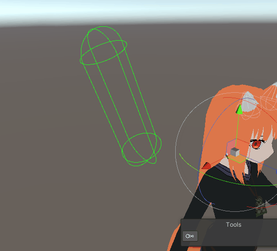

# PhysBonesHelper
 Phys bones Helper

 Lets you more eazely edit and change bones and contact senders and receivers for VRChat
 
 
 
## Features
- have visualizers for editing different bone and contacts

## Setup

### Requirements

- Unity 2019.4.29-31
- Package versions of [VRChat Base](https://github.com/vrchat/packages/tree/main/packages/com.vrchat.base) and [Avatar](https://github.com/vrchat/packages/tree/main/packages/com.vrchat.avatars) SDKs or the Avatar sdk via the site

### Installing

> Note: this will be much easier soon with the Open Beta release of the VRChat Creator Companion, Coming Soon™

- install VRChat Avatar sdk by normal means
- In your project, open the Unity Package Manager, click the + button and choose 'Add package from git URL...'.
  - Press the + button one last time and add this url: `https://github.com/Arne-van-der-Lei/PhysBonesHelper.git`
